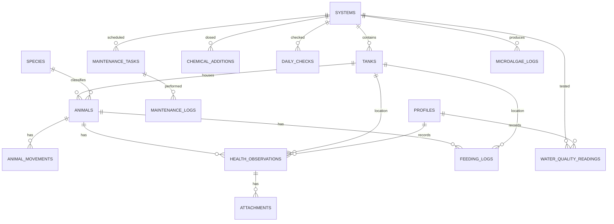

# SSL Data Collection Tool — Platform Architecture

> Covers the technical platform only (stack, schema, roles, roadmap, cost). For the lab
> itself — the 8 systems, testing cadence, Apex probes, and the historical data
> migration plan — see [lab-operations-plan.md](lab-operations-plan.md).

## 1. Overview

Sunflower Star Laboratory (SSL) is a 501(c)(3) nonprofit conservation aquaculture lab
(Moss Landing, CA) breeding *Pycnopodia helianthoides* (sunflower star) to help recover
kelp forests devastated by sea star wasting disease (SSWD), alongside protocol-species
work (sand dollars, purple urchins, *Patiria miniata*, *Pisaster giganteus*, abalone,
other urchins). SSL is currently transitioning from Phase II (small-scale cultivation /
applied research) to Phase III (large-scale cultivation and outplanting research).

The lab runs on recycled seawater (no ocean flow-through), so filter changes and sump
flushes are frequent, and water chemistry must be actively managed and tracked. This
tool exists to replace ad-hoc/paper and Google Sheets logging with a shared web
platform that lab techs and volunteers use daily, producing clean, exportable,
long-term data for correlating water quality, feeding, and husbandry events with sea
star health and SSWD symptom onset over time.

## 2. Requirements Summary

- **Data entry is exclusively through the web platform** — the goal is a single
  system of record that every tech/volunteer uses for live entry, replacing paper
  sheets and Google Sheets going forward (those remain only as historical sources to
  be imported once, see lab operations plan).
- **Multiple simultaneous, mixed-experience users** (lab techs + volunteers, ~10-20
  accounts) entering data daily — forms must be fast, guided, and forgiving of typos
  (inline range validation), not just functionally correct.
- **Water quality testing is weekly per system** (not daily) — pH, magnesium, ammonia,
  alkalinity, calcium, phosphate, nitrate, nitrite — with pH additionally available
  continuously from Neptune Apex probes on systems that have them; the other seven
  parameters are always manually tested. Nitrate is measured in ppm, nitrite in ppb
  (not ppm — a different unit than the other parameters).
- **Chemical additions** (C balance, buffers, etc.) logged per system.
- **Feeding** every other day: krill, brine shrimp, abalone, urchin (purple, sometimes white
  painted), microalgae — varies by species/life stage — plus a same-day follow-up on
  whether food was eaten.
- **Daily AM/PM checks**: water running in all tubes/systems, star health (arm drops,
  spine drops, lesions, arm curling, flattening, other), sump/system temperature.
- **Individual tracking**: sea stars/urchins/abalones get a unique **nickname**
  (e.g., "Sitara", "Titan"), unique lab-wide, not just a tank-scoped tag; multiple
  named animals can share one tub, and every feeding/consumption/health log is
  recorded per individual animal, never bulk-logged for the tub. Larval cone-bottoms
  are tracked as a batch/cohort **per pair** (the 2-tank pair is the logging unit, not
  the individual cone-bottom).
- **Micro-Algae production tracking**: its own logs (density/turbidity, harvest
  volume fed to Larval, culture condition notes) — not just an implicit input to
  Larval feeding logs.
- **Maintenance scheduling**: recurring filter changes and sump flushes, interval
  configurable **per system** (not shared per task type across all systems), with
  due-date tracking and reminders to admins/lead techs only.
- **Historical data migration**: existing Google Sheets and paper logs (feeding, water
  quality, etc.) need to be brought in — via structured CSV import for spreadsheets and
  an efficient bulk/backfill entry UI for paper records — without being confused with
  live-entered data (see provenance fields in §4).
- **Auth**: Google sign-in (~10-20 accounts), gated by admin approval (not strictly
  limited to a Workspace domain, to allow outside collaborators if needed).
- **Roles**: Admin, Technician, Volunteer (lab-wide access like Technician, but a
  distinct role so paid-staff vs. volunteer entries are distinguishable; exact
  permission differences TBD), Viewer (read-only, e.g. PI/researcher).
- **Photo attachments** on health observations: always mandatory for arm drops, spine
  drops, and lesions; mandatory for other issue types only above a certain severity
  on a 3-level scale (exact thresholds TBD, see lab operations plan open questions).
- **Connectivity**: reliable WiFi in the lab — no offline-first requirement.
- **Analytics**: both in-app dashboards/trend charts and clean raw data export for
  external stats (R/Python/Excel), since this data ultimately supports conservation
  research and reporting.
- **Budget**: nonprofit, cost-efficient; no strong cloud preference.
- **Maintainer**: one developer today, comfortable in both Python and JS/TypeScript,
  possible future dev/IT support.

## 3. Architecture Decision & Tech Stack

Chosen: **Next.js frontend + Supabase (managed Postgres) backend.**

Rationale: the core long-term value of this tool is correlating structured events
(water chemistry, feeding, chemical additions, maintenance) with health outcomes —
this is fundamentally relational/SQL analysis, which favors a Postgres-backed system
over a NoSQL document store (e.g., Firebase/Firestore). Supabase bundles Postgres +
Auth (Google OAuth) + Storage (photos) + Row Level Security in one managed service,
minimizing operational burden for a solo maintainer, while remaining inexpensive at
this scale. Next.js was chosen over Python-native frontends (Streamlit, Dash, Reflex,
NiceGUI) because this app is mostly role-gated, multi-page CRUD forms used daily by
many concurrent users — Next.js + Supabase Auth/RLS is the most robust and mature fit
for that, and the maintainer is comfortable in TypeScript/React as well as Python.

**Stack:**
- **Frontend**: Next.js + TypeScript + Tailwind CSS, deployed to Vercel (free "Hobby"
  tier to start); responsive layout for tablet use tank-side, designed mobile/tablet-first
  since that's where entry actually happens (see §6 usability items).
- **Backend/DB**: Supabase — Postgres, Google OAuth, Storage (photos), Row Level
  Security for role enforcement, auto-generated REST/GraphQL API.
- **Charts**: Recharts for trend lines, correlation/overlay views.
- **Reminders**: Supabase scheduled Edge Function (pg_cron) + Resend (free tier) for
  overdue-maintenance email digests.
- **Monitoring** (optional, later phase): Sentry free tier.
- **Apex integration** (optional, later phase): Neptune Apex Fusion exposes a
  local/cloud API; polling it for continuous pH would give higher-resolution trend
  data than the weekly manual reading, but adds an integration/maintenance surface —
  deferred until the manual-entry MVP is validated (see lab operations plan).

## 4. Data Model

**Core tables:**
- `profiles` — id (-> auth.users), email, display_name, role (admin|technician|volunteer|viewer), status (pending|active)
- `systems` — id, name, description, has_animals (bool, false for e.g. the micro-algae
  system — see lab operations plan for the full list of 8 systems)
- `tanks` — id, system_id, name/label, tank_type (shelf|cone_bottom|main), pair_group (nullable, for larval pairs — feeding/health/water-quality logs for larval tanks are recorded once per `pair_group`, not per individual cone-bottom tank)
- `species` — id, common_name, scientific_name, category (star|urchin|abalone|other)
- `animals` — id, tank_id (current), species_id, name (nickname, e.g. "Sitara"; unique lab-wide, not just per tank), life_stage/size_class, tracking_type (individual|cohort), quantity (default 1), status (active|deceased|transferred), date_added, notes
- `animal_movements` — id, animal_id, from_tank_id, to_tank_id, moved_at, reason, recorded_by
- `water_quality_readings` — id, system_id, tested_at (the actual test date — weekly
  cadence, not daily), recorded_by, ph, ph_source (manual|apex_probe), magnesium,
  ammonia, alkalinity, calcium, phosphate, nitrate (ppm), nitrite (ppb), notes,
  `data_source` (live|import|
  paper_backfill), entered_at (defaults to now(), distinct from `tested_at` for
  backfilled rows)
- `chemical_additions` — id, system_id, chemical_name, amount, unit, added_at, recorded_by, reason, data_source
- `daily_checks` — id, system_id, check_type (AM|PM), checked_at, water_running (bool), temperature, recorded_by, notes, flagged_health_observation_id (nullable, set when a check flags an issue and a follow-up health observation is opened but not yet completed), data_source
- `microalgae_logs` — id, system_id (the Micro-Algae system), logged_at, density_reading, harvest_volume, condition_notes, recorded_by, data_source
- `health_observations` — id, animal_id, tank_id, observed_at, issues (multi-select: arm_drop, spine_drop, lesion, arm_curling, flattening, other), severity (3-level scale, exact labels TBD), photo required at submit time for arm_drop/spine_drop/lesion always, and for other issue types above a severity threshold (TBD), notes, recorded_by, data_source
- `feeding_logs` — id, tank_id, animal_id (required for tanks with named individuals; logged per animal even when multiple animals share a tank), food_type (krill|brine_shrimp|abalone|urchin_purple|urchin_white|microalgae|other), amount, fed_at, recorded_by, consumption_status (full|partial|none|unknown), consumption_checked_at, notes, data_source
- `maintenance_tasks` — id, system_id, task_type (filter_change|sump_flush|other), recurrence_days (configurable per system, not shared lab-wide per task type), last_performed_at, next_due_at (computed)
- `maintenance_logs` — id, task_id, performed_at, performed_by, notes
- `attachments` — id, parent_table, parent_id, storage_path, uploaded_by, uploaded_at (generic photo attachment, primarily used by `health_observations`, also usable to archive scanned paper logs)

Every log table carries a `data_source` enum (`live` | `import` |
`paper_backfill`) plus separate event-time (`tested_at`/`checked_at`/`observed_at`/
`fed_at`/`added_at`) vs. row-insert-time (`entered_at`) fields. This is the direct
fix for the usability/analysis risk of mixing live entry with manually-migrated
Google Sheets and paper records — without it, trend charts can't distinguish real
data gaps from migration lag, and a bad backfill can't be traced to its source.

## 5. Roles & Permissions

Enforced via Postgres Row Level Security policies:
- **Admin** — full manage access: systems, tanks, species, animals, users/roles, all logs
  (full CRUD on all operational log tables).
- **Technician** — full CRUD on all log tables (water quality, feeding, health, daily
  checks, chemical additions, maintenance, micro-algae). Lab-wide access, no
  per-system restriction.
- **Volunteer** — read and update on all log tables, but cannot insert new rows or
  delete; distinguishes paid-staff vs. volunteer entries by restricting who can create
  records.
- **Viewer** — read-only across all tables (e.g., PI/researcher).
- **Unauthenticated** — no access.

New Google sign-ins land as `profiles.status = pending`; an Admin approves and assigns
a role before the account gets any data access.

## 6. Implementation Roadmap

> For the actionable, priority-ordered checklist (what to build first now that the
> Supabase project exists), see [implementation-checklist.md](implementation-checklist.md).

1. **Foundations** — Supabase schema/migrations, RLS policies, Google OAuth +
   admin-approval flow, Next.js scaffold deployed. *(no dependencies)*
2. **Reference data & admin** *(depends on 1)* — CRUD UI for systems, tanks, species,
   animals, user management/approval.
3. **Daily operational logging** *(depends on 2; the 4 forms below are parallelizable)*
   - AM/PM check form (water running, temperature, notes) — an "issue found" flag
     opens/pre-fills a linked health observation, which can be saved as a follow-up
     rather than completed immediately; the check itself still submits right away
   - Health observation form (issue checklist, severity, photo upload)
   - Feeding log form (food type/amount/time), logged per individual named animal,
     + a same-day consumption follow-up (also per animal) rolled into the PM check
   - Water quality reading form (6 chemistry params, weekly cadence) + chemical
     addition log form
   - Usability requirements for all forms: default to today's date/last-used system,
     numeric-keypad inputs for readings, multi-select checklists (not free text) for
     health issues, and inline range validation that flags (not blocks) out-of-range
     values for a tech/volunteer to double-check before submitting.
4. **"Today" dashboard** *(depends on 3)* — the actual daily landing page: per-system
   checklist of what's done/outstanding today (AM/PM check, feeding, water quality due
   this week), so nothing gets silently skipped across 8 systems and multiple people
   working the same day. Optional: per-system QR code/deep link posted at each tank
   station so a phone/tablet opens directly to that system's forms.
5. **Historical data migration tooling** *(depends on 3)* — admin-only CSV import
   (column-mapping to `water_quality_readings`/`feeding_logs`/etc., tagged
   `data_source = import`) for the Google Sheets exports, plus a
   grid/spreadsheet-style backfill entry mode (multiple past dates at once, tagged
   `data_source = paper_backfill`) for re-keying paper logs — deliberately not the
   same one-record-a-time UI as live daily entry.
6. **Maintenance scheduling** *(depends on 2, parallel with 3-5)* — task config (interval
   per system/task type), maintenance log entry, due/overdue dashboard badges, scheduled
   email reminders.
7. **Dashboards & analytics** *(depends on 3's data)*
   - Trend charts per system/parameter, with chemical-addition event overlays
   - Correlation exploration view (e.g., water quality vs. health-observation frequency)
   - CSV export of raw tables; optional direct read-only Postgres access for R/Python analysis
8. **Polish & rollout** *(depends on all prior)* — tablet/mobile QA at real lab stations,
   seed real system/tank/species data, staff onboarding, verify automated backups,
   optional Sentry error monitoring.

## 7. Cost Estimate

- **Start**: $0/mo — Supabase Free + Vercel Hobby (free) + Resend Free.
- **Steady state**: ~$25/mo — Supabase Pro, once photo storage/backup needs exceed the
  free tier (500MB DB / 1GB storage).

## 8. Decisions Log

- Supabase/Postgres chosen over Firebase/Firestore: relational joins needed for
  long-term correlation studies outweigh Firestore's simpler Google-native auth
  integration; Supabase supports Google OAuth too.
- Managed Supabase chosen over self-hosted Postgres+VPS: lower maintenance burden for
  a solo maintainer at a small nonprofit, despite marginally higher cost; automated
  backups included.
- Next.js chosen over Python-native frontends (Streamlit/Dash/Reflex/NiceGUI): this app
  is primarily role-gated, multi-page daily CRUD forms, which Next.js + Supabase
  Auth/RLS handles more robustly; maintainer is comfortable in both stacks.
- No offline-first requirement — lab has reliable WiFi.
- Larval cone-bottoms tracked as cohorts (batch-level); other animals get individual IDs.
- Google sign-in gated by admin approval rather than strict Workspace-domain
  enforcement, to allow non-Workspace collaborators.
- Water quality testing corrected to weekly (not daily) per system; a `ph_source`
  field distinguishes Apex-probe pH from manual readings, and direct Apex API
  integration is deferred rather than built into the MVP.
- Live vs. migrated data kept in the same tables (not separate historical tables),
  distinguished by a `data_source` enum + separate event-time/entered-time fields —
  simpler schema than a parallel "legacy" table set, at the cost of every log table
  needing that column.
- Volunteers get their own role (distinct from Technician) to distinguish paid-staff
  vs. volunteer entries: Volunteers can read and update log records but cannot insert
  or delete, while Technicians get the same full CRUD access as Admins on logs.
- An AM/PM check that flags an issue auto-opens a linked health observation, but that
  observation can be saved as a follow-up rather than completed on the spot; it stays
  flagged on the check record (no separate dashboard-level nagging) until filled in.
- Individual animals are identified by a unique, lab-wide nickname rather than a
  tank-scoped tag/label, matching how staff already name animals informally; every
  feeding, consumption, and health log is recorded per animal, even when several
  named animals share one tub.
- Larval cone-bottom pairs are logged as one unit (per `pair_group`), not per
  individual cone-bottom tank, matching how the cohort is actually managed.
- Micro-Algae gets its own `microalgae_logs` table (density, harvest volume,
  condition notes) rather than being tracked only implicitly through Larval feeding.
- Maintenance interval is configurable per system, not shared per task type across
  all systems, since systems vary enough in usage/load.
- Overdue-maintenance email digests go to Admins only, not all techs/volunteers.
- Trend charts always show all `data_source` values together by default — no
  live-vs-imported filter/toggle for the MVP.
- CSV export is sufficient for now; no standardized format (e.g., Darwin Core) is
  required by a partner/grant at this time.
- Vercel chosen over Netlify for hosting: first-party Next.js support (zero-config
  previews, image optimization) fits a solo maintainer better than the marginal ToS
  benefit of Netlify's free tier; revisit only if Vercel's Hobby-tier non-commercial
  ToS turns out to be a real blocker for a registered nonprofit, in which case upgrade
  to a paid Vercel plan rather than switching hosts.

## 9. Open Questions / Further Considerations

1. Health observation severity scale — define the exact 3-level labels/criteria, and
   which severity level(s) make a photo mandatory for issue types beyond arm
   drop/spine drop/lesion.
2. Animal nickname reuse policy — is a name ever reused after an animal dies or is
   transferred out?
3. Water quality target/safe ranges per parameter still need to be gathered from
   staff for inline validation (see lab operations plan).
5. Feeding cadence varies by system/species/life stage — the actual schedule matrix
   still needs confirming with staff before encoding (see lab operations plan).
