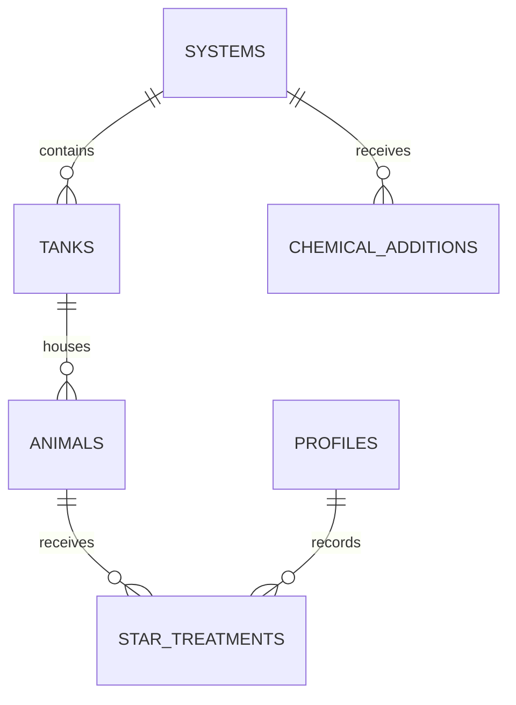

# Star Treatments Design

- **Status:** Implemented with closure items; this is the current feature contract
- **Change class:** Tier 3 feature plus a separate Tier 4 Graham reconciliation
- **Current scope:** Schema, RPC lifecycle, entry form, and correction surface are in the
  repository. Remaining work is tracked centrally in
  [implementation-checklist.md](implementation-checklist.md#star-treatment-closure).

## 1. Summary

Separate two operational events that currently risk being mixed together:

| Event | Scope | Examples | Destination |
|---|---|---|---|
| System chemical addition | The water/system as a whole | C-Balance, magnesium dosing, DI trace, buffers | `core.chemical_additions` |
| Star treatment | One specific named star | Probiotics, reef dips, topical treatment | New `core.star_treatments` table |

The Daily Operations area will present these as separate forms. The existing chemical
addition form will be clarified as a system-water dosing form, and a new Star treatment
form will collect the treated subject and treatment details.

The implemented release does not automatically move existing chemical-addition records.
Historical probiotic records need a separate, staff-reviewed reconciliation because the
source rows may not identify the treated star.

Implemented in the repository: `core.star_treatments`, eligibility and provenance RPCs,
role-gated Daily Operations entry, URL-backed filters, and the treatment correction/delete
surface. The System chemical addition database guard and unskipped end-to-end boundary
verification are still open.

## 2. Goals

- Make the system-level versus animal-level boundary unambiguous at entry time.
- Attribute every new star treatment to one specific individual star.
- Record one treatment for one star per row.
- Keep treatment events separate from system chemistry in dashboards and exports.
- Preserve project conventions for provenance, event time, RLS, and mobile-first forms.

## 3. Non-Goals

- Reclassifying or deleting existing chemical-addition data as part of the first release.
- Building treatment schedules, clinical recommendations, or dosage calculators.
- Encoding unconfirmed dosage ranges or treatment protocols.
- Replacing health observations; treatment and observed response remain separate events.
- Introducing a general veterinary-medication module for every species without a staff
  decision to broaden the feature beyond stars.

## 4. Domain Model



One `star_treatments` row represents one treatment administered to one individually
tracked star. Cohorts and multi-star rows are not supported. If several stars receive the
same treatment, staff submit one row for each star.

## 5. Proposed Table

The table intentionally stays small. Follow the repository's existing `serial` key,
text-plus-`CHECK` vocabulary, profile attribution, and event-time/provenance conventions.

| Column | Proposed definition | Notes |
|---|---|---|
| `id` | `serial primary key` | Matches current core tables. |
| `animal_id` | `int not null` FK to `core.animals(id)` with delete restricted | The treated individual star. |
| `tank_id` | `int not null` FK to `core.tanks(id)` with delete restricted | Treatment-time location snapshot. This is required even though the form derives it from the selected animal. |
| `treatment_type` | `text not null default 'probiotics'` | `probiotics`, `reef_dip`, or a trimmed custom value entered through Other. |
| `amount` | nullable positive `numeric` | Amount administered to this star, when applicable. |
| `unit` | nullable `text default 'mL'` | Paired with amount; the form defaults it to milliliters. |
| `concentration` | nullable positive `numeric` | Treatment concentration, when applicable. |
| `concentration_unit` | nullable `text default 'ppm'` | Paired with concentration; the form defaults it to parts per million. |
| `notes` | nullable `text` | Product details, lot details, deviations, or other treatment context. |
| `administered_at` | `timestamptz not null` | Actual treatment time, defaulting to now for live entry. |
| `recorded_by` | profile FK, server default | Set from the authenticated profile, never selected in the form. |
| `data_source` | constrained `text not null default 'live'` | Use current values: `live`, `import`, `paper_backfill`. |
| `entered_at` | `timestamptz not null default now()` | Database insertion time. |

Recommended indexes:

- `(animal_id, administered_at desc)` for animal history.
- `(tank_id, administered_at desc)` for treatment-time location history.
- `(treatment_type, administered_at desc)` for treatment analysis.

Recommended invariants:

- At least one of amount or concentration must be present; any supplied value must be
  positive. Do not invent an amount when only a concentration is known.
- Amount/unit and concentration/concentration-unit are nullable pairs: when a value is
  absent its unit is stored as null, and when a value is present its unit is required and
  nonblank.
- Treatment type cannot be blank.
- The selected animal must be an active, individually tracked star.
- The submitted tank must match the animal's current tank when the treatment is created.
- No uniqueness constraint should prevent repeated treatment; repeated administrations at
  the same timestamp can be valid.

Checks involving animal tracking type, species category, and current tank cannot be
expressed as simple row checks. They require a database transaction function or trigger,
not only client validation.

Defaults alone do not make provenance immutable. The migration must prevent clients from
overriding `recorded_by`, `data_source`, or `entered_at` on live entry, tie `recorded_by`
to the authenticated profile, and prevent ordinary updates from rewriting attribution or
provenance. A general activity audit is deferred as project-wide work; the Star treatment
feature does not maintain a feature-specific audit log.

After creation, `animal_id`, `tank_id`, `administered_at`, `recorded_by`, `data_source`,
and `entered_at` are immutable. Corrections may change treatment details and notes. If the
wrong star, tank, or event time was recorded, Admin or Technician hard-deletes the
incorrect row and creates a replacement.

## 6. Eligibility

The form should only show active eligible subjects. The proposed baseline is:

- Active, individually tracked stars: eligible, one row per star and treatment.
- Cohorts: excluded.
- Non-star animals: excluded.
- Micro-Algae and systems without eligible subjects: excluded from subject selection.

Selection flows from System to Tank to Star. The form derives `tank_id` from the selected
animal rather than asking users to enter it twice, but the database stores that value as a
treatment-time snapshot. Deriving historical location only from `animals.tank_id` would
silently rewrite past treatment locations whenever an animal moves and would corrupt
per-system correlations. This is the one additional treatment column recommended by the
reanalysis despite the preference for a compact table.

The first release is for live treatment entry and does not allow a treatment date before
the current laboratory date. That avoids pretending the animal's current tank proves its
historical location. Older treatments are handled through reviewed backfill/import tooling
after animal/location attribution is known. Same-day entries snapshot the animal's current
tank in the create transaction.

## 7. Controlled Vocabulary

The form starts with `probiotics` selected and also offers `reef_dip` and **Other**.
Choosing **Other** opens a required text box; its nonblank value is saved directly in
`treatment_type`. Product or protocol details can also be recorded in `notes`.

Custom values must be trimmed, whitespace-normalized, length-limited, and compared
case-insensitively to the two canonical values. Reports group all noncanonical values
under **Other** while retaining the entered label for display. This keeps the table compact
without allowing spelling variations to become separate top-level analytics categories.
Limit custom treatment labels to 100 characters. If custom input normalizes to
`probiotics` or `reef_dip`, save the canonical value instead.

`unit` and `concentration_unit` are free-text boxes rather than controlled lists. They
default to `mL` and `ppm`, respectively, and users may replace those values.

## 8. Permissions And Record Lifecycle

The future migration should follow the project's current native database-role policies,
not rely only on older prose documentation.

| Role | Read | Create | Update | Delete |
|---|---:|---:|---:|---:|
| Admin | Yes | Yes | Yes | Hard delete |
| Technician | Yes | Yes | Yes | Hard delete |
| Volunteer | Yes | Yes | Yes | No |
| Viewer | No | No | No | No |
| Unauthenticated | No | No | No | No |

Blocked users, including Viewers and unauthenticated users, must not be able to see the
Star treatment navigation, form, or data. RLS must independently enforce the same rule.

Admin and Technician can hard-delete treatments; Volunteer cannot delete. All creates and
updates operate on the current treatment row, while deletes remove it. A future general
activity audit is deferred as a project-wide capability rather than implemented as a
Star-treatment-specific table. Animal deletion must not cascade into treatment-history
deletion.

Treatment create, update, and delete operations must go through narrowly granted database
functions/RPCs. Those functions validate role, active status, star eligibility, current
tank, and immutable provenance. Direct table writes from the browser should be revoked for
this table.

This table is an explicit exception to the repository's generic operational-log policy:
Admin and Technician get full mutation functions, Volunteer gets create/update functions,
and Viewer gets no grant or RLS path. UI hiding is supplemental; `core` is Data API-exposed,
so grants, RLS, and function permissions are the actual boundary.

Every mutation function must use a fixed safe `search_path`, revoke default `PUBLIC`
execute, and grant `EXECUTE` only to the intended native roles. Update accepts treatment
details only, and delete accepts only the treatment ID; neither RPC requires a reason. The
feature-specific matrix in this document is authoritative; implementation must update
conflicting role prose and RBAC tests in the same change.

## 9. Daily Operations Form

Add **Star treatment** directly after **System chemical addition** and before **Health
observation** in Daily Operations. Keep it in the Daily Operations hub instead of adding
a permanent top-level sidebar item.

Recommended canonical URL:

`/protected/daily-operations?type=star-treatment&system=<id>&tank=<id>&animal=<id>`

Daily Operations remains the active sidebar destination. Its form chooser should be
URL-backed so direct links, refresh, and browser Back restore the selected form and valid
filters. The existing local-only default-to-Daily-check behavior must be updated as part of
this feature; do not create a second canonical standalone route.

Recommended field order:

1. Administered date and time.
2. System.
3. Tank.
4. Treated star.
5. Treatment type, defaulting to **Probiotics** with **Reef dip** and **Other** options.
6. Amount and unit, with `mL` selected by default.
7. Concentration and concentration unit, with `ppm` selected by default.
8. Notes.

`recorded_by`, `data_source`, and `entered_at` are derived and enforced by the
server/database and must not be editable or client-overridable for live entry.

### Selection behavior

- URL parameters take priority, then the last successfully used system.
- Changing log type uses browser-history `push`; changing system/tank/star filters uses
  `replace` so every selector change does not create another Back-button stop.
- Changing system clears tank and subject selections.
- Changing tank clears the star selection.
- Star choices show the animal name and species.
- Invalid system clears system/tank/star. Invalid tank clears tank/star. Invalid star
  clears only star. Each case shows a clear inline message.
- Star selection is single-select.
- Choosing **Other** treatment type reveals a required text box for the custom treatment.
- After success, clear the star before another submission to prevent accidental duplicates.
- After success, retain valid system/tank filters, remove `animal` and any health-link
  parameter from the URL, and reset treatment type to Probiotics, value/unit fields, notes,
  and time.

### Validation and feedback

- Require date/time, location, star, treatment type, unit, and concentration unit.
- Require at least one value: amount or concentration.
- Require nonblank custom treatment text when **Other** is selected.
- Require positive numeric values when amount or concentration is supplied.
- Focus the first invalid field and preserve entered values after any failure.
- Revalidate active status, tank membership, species eligibility, and individual tracking
  on the server at submission time.
- Prevent double submit and translate database errors into actionable form messages.
- Show a success summary naming the treated star.
- Offer **Log another treatment** and **View system activity** after success.

### Mobile and accessibility

- Use accessible URL-backed links or segmented navigation for Daily Operations choices;
  do not apply ARIA tab semantics unless the final interaction behaves as a true tablist.
- Use clear labels and grouping for the star and treatment-type controls.
- Associate errors with their fields and announce filtering, failure, and success changes.
- Use at least 44 by 44 pixel touch targets.
- Stack value/unit pairs on phone widths and prevent horizontal scrolling.
- Keep the star selector usable on phones with a consistently reachable submit action.

Users without read/create permission must not see the Star treatment option or any
treatment data. The route, server action, and RLS must still reject direct access.

The first release also needs a treatment-specific list/detail route for authorized users
because update and hard-delete permissions are otherwise unreachable. The list supports
date range, star, and treatment-type filters so older records remain discoverable. Edit
changes treatment details without exposing immutable provenance fields. Delete confirmation
names the star, treatment, and administration time and clearly states that deletion cannot
be undone; only Admin and Technician see it.

## 10. Chemical Addition Changes

The existing table remains system-scoped. Clarify its form rather than adding an animal
relationship:

- Card and tab label: **System chemical addition**.
- Description: **Record a chemical, mineral, trace element, or buffer added to system
  water. Treatments administered to stars belong in Star treatment.**
- Field label: **Chemical/product added to system water**.
- Submit label: **Save system addition**.
- Add a nearby **Log a star treatment instead** link.
- Keep `system_id` as the only subject/location scope.
- Add database checks for positive amount and nonblank chemical name/unit when the schema
  change is implemented.

A staff-approved canonical list may include C-Balance, magnesium, DI trace, buffers, and
`other`. Probiotics always belong in Star treatment and must not be offered or accepted as
a new System chemical addition. Enforce this in the system-addition mutation as well as
the UI so a direct API request cannot reintroduce probiotics.

## 11. History, Dashboards, And Export

- First release: show treatments in the treatment-specific list/detail correction surface,
  never as chemical additions.
- First release: keep chemical-addition counts and charts limited to system-water dosing.
- Deferred: Home recent activity, Systems highlights, full cross-log History, CSV export,
  and treatment markers on animal/system timelines.
- Future exports use treatment-time tank/system, not the star's current location.
- Defer `analytics.fact_star_treatment` until the existing analytics schema has a general
  synchronization pipeline. Current dashboards query `core` directly and the analytics
  migration explicitly leaves synchronization for later.

## 12. Existing Data And Reconciliation

Migration `20260920130000_import_graham_water_quality_history.sql` is already recorded as
applied on the hosted project. It inserts 270 water-quality rows and 443 chemical-addition
rows: 242 CBalance and 201 Probiotics. It also attributes them to the dev fixture
`test-admin@ssl.dev`. Historical operational data should not replay on every fresh schema
reset, so it must be extracted from migrations into a CSV-backed, one-time import bundle.

### Migration-history strategy

- Delete migration `20260920130000` from local history and fully rebuild the disposable
  hosted `core`, `analytics`, and `public` schemas from the remaining migrations.
- Mark all hosted migration versions reverted after the schema wipe, including the removed
  `20260920130000`, before running `supabase db push`.
- Do not add a compensating DELETE migration. The filtered Graham CSV import remains a
  separate Tier 4, human-run operation after the schema replay.

### CSV import bundle

Create a bundle such as:

```text
supabase/seeds/20260920_graham/
  README.md
  graham_water_quality.csv
  graham_chemical_additions.csv
```

The two import CSVs contain only already-filtered destination values and exact destination
table headers for direct Supabase Table Editor upload. No Probiotics seed is included.

Normalize date-only Graham records using `America/Los_Angeles` explicitly before storing
`timestamptz`; do not rely on the SQL session timezone. Resolve and embed the target Graham
system ID and active Admin profile ID after each hosted schema rebuild.

### Hosted reconciliation

1. Rebuild the disposable hosted schemas without the old import migration.
2. Confirm the Graham destination tables are empty and resolve the current system/profile IDs.
3. Import only the reviewed water-quality and CBalance CSVs. Probiotics are excluded from
  this seed and cannot enter `star_treatments` until each can be tied to a named star.
4. Verify row counts, timestamps, attribution, representative multiline/null rows, and
  absence of duplicate source rows.

For future imports, add durable import identity such as an import batch and source-row key
instead of relying only on `data_source = 'import'`. This is broader than the Star treatment
table but is necessary before import tooling becomes a recurring workflow.

## 13. Remaining Sequence

The completed implementation steps and all remaining actions have been merged into the
[implementation checklist](implementation-checklist.md#star-treatment-closure). In order:

1. Add the System chemical addition database guard and repair the schema-gated boundary test.
2. Align the generic role contract and RBAC suite without changing this feature's narrower
  Viewer restriction.
3. Run the complete Tier 3 verification and preview review without skipped lifecycle tests.
4. Have a human perform the separate Tier 4 Graham import after backup and source checks.
5. Add deferred History/export/analytics integrations only after the core workflow closes.

## 14. Verification Plan

Closure remains Tier 3 under [testing-strategy.md](testing-strategy.md) because this is a
new table and RLS-backed workflow.

Required focused coverage:

- At-least-one dose value, value/unit, whitespace, and positive-number validation.
- System-to-tank-to-star filtering and stale-selection clearing.
- Treatment-time tank stability after the animal moves.
- Server-controlled attribution/provenance and rejection of direct table writes.
- Deep-link/default precedence and double-submit prevention.
- Chemical-addition copy and navigation clearly separating the two workflows.
- Custom treatment entry, unit text boxes/defaults, role visibility, current-row updates,
  and Admin/Technician hard deletion.
- RPC-only create/update/delete behavior, immutable provenance fields, and role controls.
- Keyboard, screen-reader labeling, phone-width, and tablet behavior.

Required release verification:

- Apply migration to scratch/staging before production.
- Inspect the table, constraints, grants, and RLS directly in Supabase.
- Run the project's full e2e-testing skill.
- Verify Admin, Technician, Volunteer, Viewer, and unauthenticated behavior.
- Verify saved rows and timestamps directly in Supabase, not only through the UI.
- Confirm treatment activity does not alter chemical-addition counts.
- Use a preview deployment and require human diff review before merge.

The Graham cleanup/reimport is separately Tier 4: verify checksums and expected counts,
take a fresh backup, have a human execute the exact reviewed transaction, and spot-check
the result against the source CSVs.

## 15. Resolved And Deferred Decisions

- Treatment type defaults to `probiotics`; `reef_dip` is predefined, and **Other** opens
  a required custom text box.
- Unit fields are free text, defaulting to `mL` and `ppm`.
- Probiotics are always Star treatments, never System chemical additions.
- Admin, Technician, and Volunteer can read, create, and update treatments. Volunteer
  cannot delete. Viewer, unauthenticated, and other blocked users cannot view the feature
  or its data.
- Admin and Technician can hard-delete treatments. A future general activity audit is
  deferred as project-wide work.
- Reanalysis recommends storing treatment-time `tank_id`. Omitting it would move historical
  treatments whenever `animals.tank_id` changes.
- Historical Probiotics rows without a known treated star are unresolved. After exact
  hosted cleanup they remain in the unresolved CSV, not in `chemical_additions`.
- **Log another treatment** defaults treatment type back to `probiotics`; other values
  reset rather than being retained.
- No amount or concentration warning ranges will be added.
- A treatment may optionally link to the health observation that prompted it. Implement
  this from the health-observation side or a small link table so the compact treatment
  table does not gain another column.
- The optional health-observation link is deferred from the first release. Its cardinality,
  permissions, and workflow must be designed before adding it; it is not part of required
  first-release verification.
- **Deferred:** choose the time window for a likely-duplicate warning. This does not block
  the first implementation; duplicate detection can be omitted until the window is set.

## 16. Additional Repository Concerns

- **Role test drift:** native grants allow Volunteer create/update on operational logs,
  while the current RBAC smoke test still expects Volunteer inserts to fail. Update the
  test and role documentation before relying on it for this feature.
- **Role fixtures:** local seed now includes Admin, Technician, Volunteer, and Viewer. Keep
  the test-account documentation and role matrix aligned with those fixtures.
- **Reference data in migrations:** systems/species, Graham tanks, and SSL25 are also
  inserted by migrations. They are not historical operational logs, so do not mix their
  relocation into this feature, but review them separately against the schema-only
  migration convention.
- **Delete consequences:** treatment FKs with delete restriction mean systems/tanks/animals
  with treatment history cannot be hard-deleted through existing cascades. Prefer retiring
  roster/reference records over deleting them, and make admin UI errors explicit.
- **Analytics is not populated:** the analytics schema exists but has no sync triggers.
  Query `core` for the first treatment release and avoid adding an empty or stale fact
  table prematurely.
- **History is a placeholder:** keep full cross-log filters and export out of the first
  implementation; build only the treatment discovery surface required for correction and
  authorized deletion.